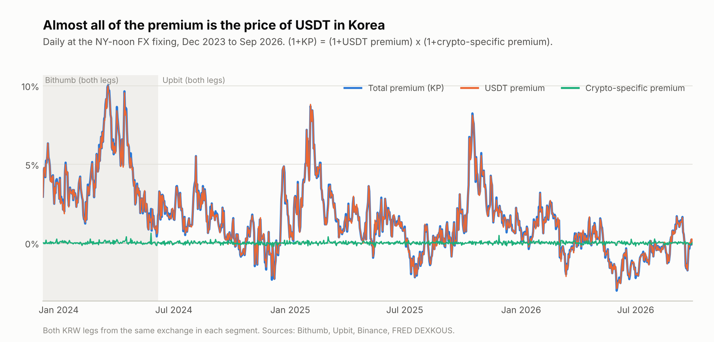
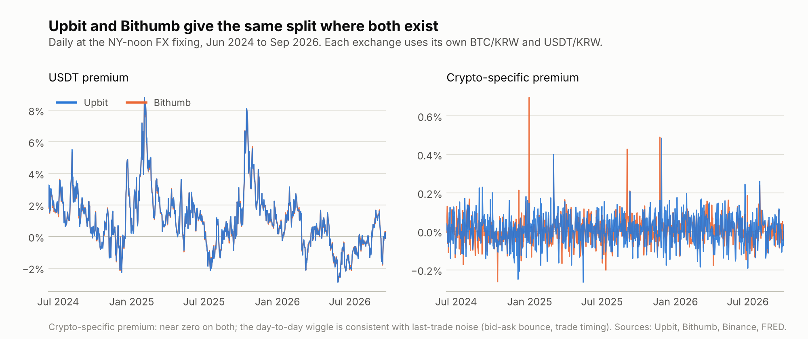
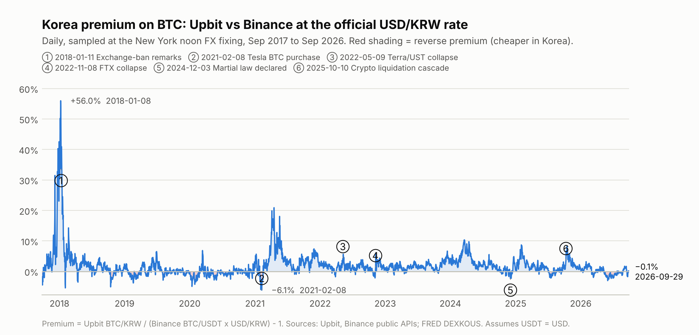
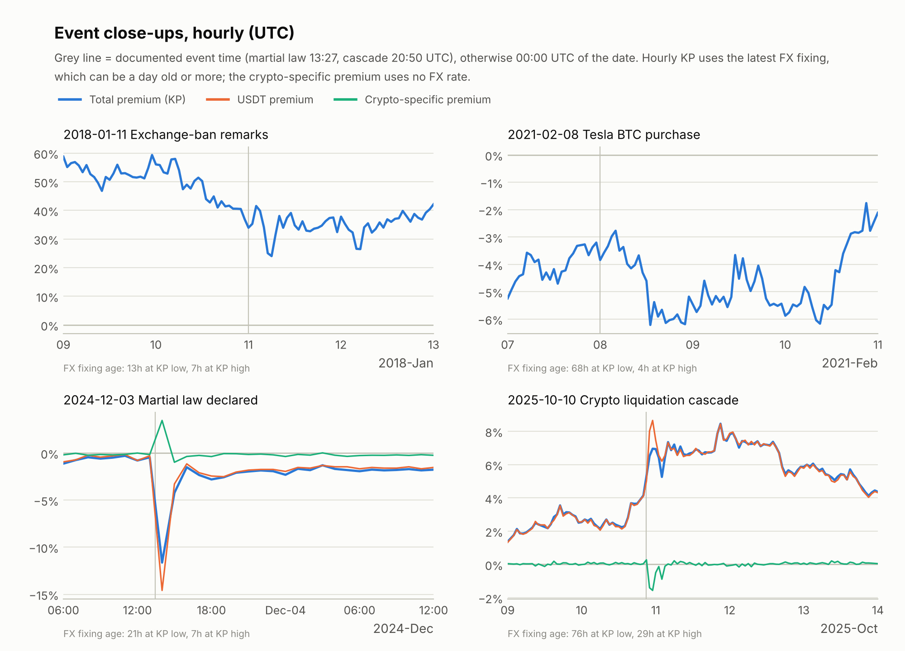
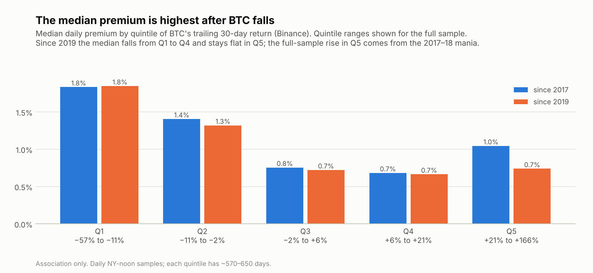
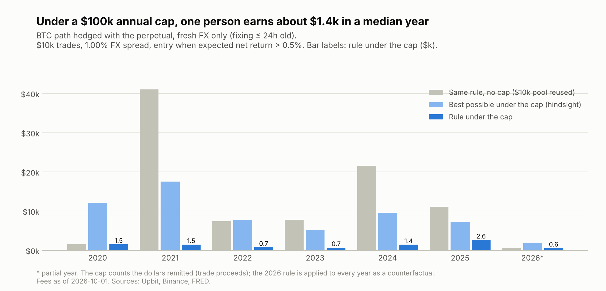
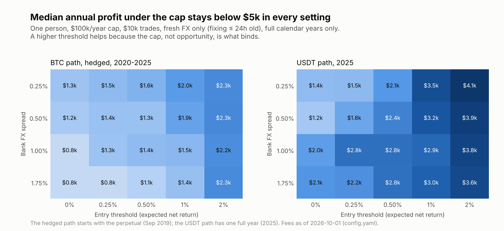

# Kimchi Premium: how big, when, and why arbitrage does not close it

Public market data, September 2017 to September 2026, hourly. Fees as published on 2026-10-01.
Research only: no trades are placed, and nothing here is a trading recommendation.

## Question

How large is the Korean exchange premium on BTC, when does it widen, and why does
cross-border arbitrage not compete it away?

## TL;DR

1. **About 99% of the premium is the won price of USDT, not of bitcoin.** Since December 2023 the
   USDT premium explains 99.2% of both the average premium and its day-to-day variation. The part
   that moving coins between exchanges could close averages 0.01%.
2. **Capacity, not opportunity, is what binds.** Under the US$100k annual per-person cap on
   undocumented remittances, a rule-based arbitrage hedged with futures earns one person about
   **$1.4k in a median year** (2020–2025). Even perfect hindsight caps out at $5.1k–17.6k a year;
   without the cap, the same rule earns 4–28× more from one $10k pool (2021–2025).
3. **Because the premium is a USDT price, a USDT round trip captures it with the risk of a hedged
   trade and no hedge.** Expected net return at signal hours is 1.94%, against 1.96–1.98% on the BTC
   routes. Realized minus expected has a standard deviation of 0.23pp, close to a futures-hedged BTC
   trade (0.24pp) and well below an unhedged one (0.54pp). The FX rate is a daily fixing that
   rarely changes within the one-hour transfer, so this compares crypto-price risk, not FX risk.

Also in the results: the median premium is highest after BTC falls (1.8% in the bottom fifth of
30-day returns, against 0.8% in the middle fifth), and 2026 to date averages −0.06%, the first year
since 2020 with more reverse-premium days (52%) than not.

## Data

| Series | Source | Coverage | Frequency |
|---|---|---|---|
| BTC/KRW | Upbit public API, `KRW-BTC` | 2017-09-25 → 2026-09-30 | 1h (daily used only as a cross-check) |
| USDT/KRW | Upbit public API, `KRW-USDT` | 2024-06-07 (listing) → 2026-09-30 | 1h |
| BTC/KRW, USDT/KRW | Bithumb public API v1, `KRW-BTC`, `KRW-USDT` | 2023-12-07 (Bithumb's USDT listing) → 2026-09-30 | 1h |
| BTC/USDT | Binance public API, `BTCUSDT` spot | 2017-09-25 → 2026-09-30 | 1h (daily used only as a cross-check) |
| USD/KRW | FRED `DEXKOUS` (noon buying rate, New York) | 2017-09-11 → 2026-09-25 (latest fixing published) | business days |
| BTC perpetual funding | Binance USD-M `fundingRate`, `BTCUSDT` | 2019-09-10 → 2026-09-30 | every 8h |

Downloaded on 2026-09-30; the last Upbit and Binance hourly candles close at 14:00 UTC (Bithumb's
at 15:00). No API keys are needed. Raw
downloads are cached in `data/raw/` (not committed) with a manifest of the request parameters; a
cached file is reused while those parameters in `config.yaml` are unchanged, and `--refresh`
downloads again.

## Method

**Premium**

$$KP_t = \frac{P^{KRW\ exchange}_{BTC/KRW}}{P^{Binance}_{BTC/USDT}\times FX_{USD/KRW}} - 1$$

**Decomposition.** The identity is exact:

$$1+KP_t = \underbrace{\frac{P_{BTC/KRW}}{P^{Binance}_{BTC/USDT}\times P_{USDT/KRW}}}_{\text{crypto-specific premium}} \times \underbrace{\frac{P_{USDT/KRW}}{FX_{USD/KRW}}}_{\text{USDT premium}}$$

- The **USDT premium** is mostly what a dollar costs inside Korea, i.e. the price of the
  capital-flow restriction. It also absorbs any gap between USDT and USD.
- The **crypto-specific premium** is the gap left after that: the cost of moving coins between exchanges.
  It uses only exchange prices at the same moment, so it contains no FX timing error.
- **Both KRW legs always come from one exchange.** Bithumb is used from 2023-12-07 until the day
  Upbit listed USDT (2024-06-07), and Upbit after that. Mixing exchanges would put the
  cross-exchange price gap into the split.
- **The two exchanges agree over 845 overlapping days:**
  - USDT premium: correlation 0.9994, mean absolute difference 0.05pp.
  - Crypto-specific premium: mean absolute difference 0.06pp. Its correlation is only 0.45,
    because both series sit near zero, where hourly last-trade noise dominates.

**What "99%" means.** In logs the two parts add up exactly:
ln(1+KP) = ln(1+crypto-specific premium) + ln(1+USDT premium). Two shares are reported:

- *Level share* = mean ln(1+USDT premium) / mean ln(1+KP). This is the part of the average premium.
- *Variation share* = cov(ln(1+USDT premium), ln(1+KP)) / var(ln(1+KP)). This is the part of the
  day-to-day movement. Because it is covariance-based, the USDT and crypto-specific shares sum to
  exactly 100%.

The level share is unstable when the average premium is near zero. For 2026 (mean −0.06%) it reads
117% and should be ignored; the 2026 variation share is 99.0%.

**Timing alignment.** `DEXKOUS` is fixed at 12:00 New York time (16:00 or 17:00 UTC). Daily candles
close at 00:00 UTC, 7–8 hours later. So the daily series samples hourly closes at the FX fixing moment.

- Prices: the last hourly close at or before the fixing. A fallback of up to 3h is flagged; anything
  older is NaN.
- FX: the latest earlier fixing on weekends and holidays, flagged. Anything older than 4 days is NaN.
- The hourly table uses only fixings already made at each hour.
- On the same FX rate, sampling at the 00:00 UTC close instead moves the premium by a median of 0.26pp
  (1.35pp at the 95th percentile). That is the same order as arbitrage costs.

**Events.** Each candidate event is checked against the hourly premium before it is drawn. It is
annotated only if, within 72h after the event, the premium moved at least 2pp away from its mean
over the 24h before. Only post-event hours count, so a move already under way cannot qualify an
event (`data/processed/events_check.csv`). For intraday shocks, the FX-free crypto-specific
premium is the main measure, because hourly KP carries the latest fixing, which can be a day old
or more; the age of that fixing is reported at each extreme.

**Drivers** (associations only, no causal claim):

- the BTC 30-day return;
- Upbit trading value relative to its 90-day median (log);
- USD/KRW volatility over 21 fixings.

Rank correlations are computed daily and on monthly means. Quintile tables use daily data. A
regression runs on monthly means with Newey-West standard errors, because the daily premium is
highly persistent.

**Backtest.** The backtest covers the positive-premium direction only. Every round trip ends by
converting won to dollars at the bank and remitting them abroad. The dollars remitted, i.e. the
trade's proceeds, count against the annual cap (US$100k per person, the 2026 rule, applied to every
year as a counterfactual). Each trade is sized so that its proceeds expected at entry fit in what
is left of the cap; a landing better than expected can overshoot it slightly (by at most $0.2k in
any year here).

- *BTC path:* buy BTC on Binance → withdraw to Upbit (1h) → sell for KRW → KRW to USD → remit.
  There are two variants:
  - unhedged: carries BTC price risk in transit;
  - hedged: shorts the BTC perpetual in transit, paying futures fees and receiving any funding
    settled in transit.
- *USDT path:* USDT on Binance → withdraw to Upbit (1h) → sell for KRW → KRW to USD → remit.
  It exists only since Upbit listed USDT (2024-06-07).
- *FX used:* won are converted at the latest FRED `DEXKOUS` fixing at the hour the transfer lands,
  times (1 + bank spread of 1%).
- *Rule:*
  - Trade at the first hour whose **expected** net return exceeds the entry threshold (0.5%).
    Expected means prices at entry; the outcome uses prices when the transfer lands.
  - Each trade is up to US$10k (less for the year's last slice), with fixed fees applied per trade.
  - The capital is reusable 2 days later, after the bank remittance.
  - The cap resets on 1 January.
- *References:* the same rule without the cap, and the hindsight upper bound (one trade on the
  year's single best hour, sized so that its proceeds use the whole cap).
- *Headline basis:* the hedged BTC path, using only hours whose FX fixing is at most 24h old at
  entry and at landing.
  - Hindsight and no-cap figures pick extreme hours. Those are where a stale fixing can create a
    premium that was not there. Unhedged figures also include lucky price moves in transit.
  - The hedged path starts with the perpetual in September 2019, so its full years are 2020–2025.
  - The other variants are reported under "Robustness".
- *Sensitivity:* bank FX spread (0.25–1.75%) × entry threshold (0–2%). The metric is median annual
  profit, over full calendar years only.

Assumptions: USDT = USD. Close prices only, with no order-book depth.

## Results

### 1. What the premium is made of



*Chart 1.* Contribution of the USDT premium, from `data/processed/decomposition_contribution.csv`:

| Period | Days | Mean KP | USDT premium share of level | USDT premium share of variation |
|---|---|---|---|---|
| Bithumb segment (2023-12-07 → 2024-06-06) | 183 | +4.28% | 99.3% | 98.6% |
| Upbit segment (2024-06-07 → 2026-09-29) | 845 | +1.03% | 99.1% | 99.3% |
| All | 1,028 | +1.60% | 99.2% | 99.2% |
| Days with KP > 2% | 357 | +4.03% | 99.1% | 99.5% |



*Chart 1b.* Where both exchanges exist, they give the same split.

### 2. How big, and when



*Chart 2.* The daily peak is +56.0% (2018-01-08); hourly it reached +69.2% (2018-01-08 15:00 UTC).
The deepest daily reverse premium is −6.1% (2021-02-08). Numbered events passed the hourly check.
Yearly distribution: `data/processed/summary_by_year.csv`.

Hourly KP after each event (72h window; times UTC, candle close):

| Event (UTC) | Mean in the 24h before | Low after | High after | FX fixing age at low / high | Crypto-specific premium after |
|---|---|---|---|---|---|
| 2018-01-11 Exchange-ban remarks | +47.6% | +24.0% at 01-11 06:00 | +42.2% at 01-13 00:00 | 13h / 7h | n/a |
| 2021-02-08 Tesla BTC purchase | −4.0% | −6.2% at 02-08 13:00 | −1.8% at 02-10 21:00 | 68h / 4h | n/a |
| 2022-05-09 Terra/UST collapse | +3.2% | +2.9% at 05-10 13:00 | +10.0% at 05-11 21:00 | 21h / 5h | n/a |
| 2022-11-08 FTX collapse | −0.9% | −0.05% at 11-08 01:00 | +7.7% at 11-09 21:00 | 8h / 4h | n/a |
| 2024-12-03 13:27 Martial law declared | −0.6% | −11.6% at 12-03 14:00 | +0.2% at 12-06 00:00 | 21h / 7h | −1.0% to +3.5% (+3.5% at the KP low) |
| 2025-10-10 20:50 Crypto liquidation cascade | +2.8% | +4.3% at 10-13 20:00 | +8.5% at 10-11 21:00 | 76h / 29h | −1.6% to +0.3% |

The crypto-specific premium exists only from December 2023 (Bithumb, then Upbit).



*Chart 3.* The note under each panel gives the age of the FX fixing behind KP at its post-event
low and high. What the hourly data shows:

- **2018-01.** The premium fell in two steps.
  - The second step, 41% to 24% between 02:00 and 06:00 UTC on Jan 11 (11:00–15:00 KST), lines
    up with the Justice Minister's exchange-ban remarks. He made them at the ministry's New Year
    press conference in Gwacheon on the morning of Jan 11 (YTN).
  - The first step, about 50% to 41% on the evening of Jan 10 (KST), came before the remarks.
    Its cause is not identified here.
- **2021-02-08.** A reverse premium of −3% to −5% already existed the day before. It widened to −6.2%
  in the hour BTC jumped abroad: Binance +9.0% against Upbit +7.2% (12:00–13:00 UTC). The level
  is measured against Friday's fixing (68h old), but the one-hour widening is not, because both
  hours use the same fixing. Within three days the reverse premium had narrowed to −1.8%.
- **Martial-law night.** The −11.6% hourly KP is measured against a 21h-old FX fixing. The FX-free
  crypto-specific premium was +3.5%: on Upbit, USDT/KRW fell further than BTC/KRW.
- **October 2025.** The premium was already rising after the US tariff post on China at 14:57 UTC,
  from +2.3% at 14:00 to +4.1% at 20:00 UTC, driven by Upbit USDT/KRW (1,456 → 1,487 won); the new
  FX fixing at 16:00 (1,423.68 → 1,428.39) offset about 0.3pp of it. After the cascade began at
  20:50 UTC, almost all of the further rise was the USDT premium, which reached +8.7% at 23:00 UTC
  against a 7h-old fixing, far more than FX moves since that fixing could explain. The
  crypto-specific premium stayed near zero apart from −1.4% and −1.6% in the two hours after the crash.

### 3. What moves with it



*Chart 4 and drivers* (`data/processed/drivers_*.csv`):

- **BTC 30-day return.** The median premium by quintile, from the largest falls to the largest rises,
  is 1.8% / 1.4% / 0.8% / 0.7% / 1.0% over the full sample and 1.8% / 1.3% / 0.7% / 0.7% / 0.7%
  since 2019. The rise in the top quintile comes from the 2017–18 mania.
- **Monthly regression since 2019.** One standard deviation higher BTC return goes with a
  0.72pp lower premium (Newey-West t = −2.3). One standard deviation higher Upbit trading value
  goes with +0.59pp (t = 2.0). FX volatility shows no clear link.
- **Explanatory power is low.** R² is 0.07 since 2019 and 0.17 including the 2017–18 mania.
  These three variables explain little of the premium.

*Interpretation.*

- The usual story, "the premium rises with retail euphoria in bull markets", explains little here:
  - trading value is only weakly linked;
  - the median premium is highest after falls, and since 2019 it does not rise in the strongest rallies;
  - the 2017–18 mania is the main exception.
- What the data does support is narrower:
  - The premium is almost entirely the won price of USDT.
  - It tends to be higher after offshore prices fall. The quintile pattern and the event examples
    both point this way; the lag mechanism is not tested.
- Why USDT is priced as it is lies outside these three variables. The Discussion below offers one
  hypothesis.

### 4. Why arbitrage does not close it



*Chart 5.* Annual profit for one person on the headline basis: hedged BTC path, fresh FX only
(`data/processed/backtest_yearly.csv` has every path and variant).

| Year | Rule under the cap | Hindsight best under the cap | Same rule, no cap ($10k pool) |
|---|---|---|---|
| 2020 | $1.5k | $12.1k | $1.5k |
| 2021 | $1.5k | $17.6k | $41.0k |
| 2022 | $0.7k | $7.7k | $7.4k |
| 2023 | $0.7k | $5.1k | $7.8k |
| 2024 | $1.4k | $9.5k | $21.5k |
| 2025 | $2.6k | $7.2k | $11.1k |
| 2026 (to Sep) | $0.6k | $1.8k | $0.6k |

- **The cap binds, not opportunity.** In 2021 the expected net return exceeded the 0.5% threshold
  in 68.5% of hours. The rule used its whole cap in ten trades between 4 January and 26 February,
  expecting 0.5–4.0% each. The April peak of about 20% went unused.
- **In 2020 and 2026 the cap did not bind:** qualifying hours were rare (2–3% of hours), so the rule
  earned the same with or without it.
- **2018 predates the perpetual, so only the unhedged path exists.** With fresh FX only, the rule
  earned $24.6k that year: the mania is the one period in the sample when the cap still left a
  large gain.

**Robustness** (`data/processed/backtest_robustness.csv`, full calendar years):

| Variant | Path (years) | Median rule profit | Hindsight best, range | No cap, range |
|---|---|---|---|---|
| Baseline, all hours | BTC unhedged (2018–2025) | $1.8k | $6.1k–40.9k | $3.6k–53.3k |
| Baseline, all hours | BTC hedged (2020–2025) | $1.5k | $5.1k–17.6k | $2.5k–50.6k |
| Baseline, all hours | USDT (2025) | $1.8k | $9.4k | $15.6k |
| Fresh FX only (≤ 24h) | BTC unhedged (2018–2025) | $1.5k | $6.1k–37.6k | $1.6k–41.9k |
| **Fresh FX only (≤ 24h)** | **BTC hedged (2020–2025)** | **$1.4k** | **$5.1k–17.6k** | **$1.5k–41.0k** |
| Fresh FX only (≤ 24h) | USDT (2025) | $2.8k | $7.4k | $12.5k |
| Fixed fees doubled (all hours) | BTC hedged (2020–2025) | $1.4k | $5.1k–17.5k | $2.1k–46.4k |

- **The rule-based median stays between $1.4k and $2.8k in every variant.** The two USDT figures
  ($1.8k, $2.8k) rest on a single year, 2025.
- **The extremes move more.** Dropping stale-FX hours cuts the no-cap maximum by about 20% (hedged:
  $50.6k → $41.0k) and the 2025 USDT hindsight from $9.4k to $7.4k. The best USDT hour of 2025
  was Monday 2025-02-03 03:00 UTC, priced against the previous Friday's fixing (58h old).
- **Unhedged hindsight includes luck in transit.** In 2020 the unhedged figure is $21.0k, against
  $12.1k hedged. That is why the upper bound is quoted on the hedged path.



*Chart 6.* Across every FX spread and entry threshold tested, median annual profit stays between
$0.8k and $2.3k on the hedged BTC path (2020–2025) and between $1.2k and $4.1k on the USDT path (2025).
Every cell's trades are in `data/processed/backtest_sensitivity_trades.csv`.

**Why a higher cost can raise profit (the grid's apparent paradox).** On the USDT path with a 0%
threshold, a 1.75% FX spread earns more in 2025 ($2.1k) than a 0.25% spread ($1.4k). The trade
logs show why:

- *At 0.25%,* the rule starts trading on 1 January at small premiums (USDT premium 0.8–3.9%). It
  uses the whole cap by 23 January.
- *At 1.75%,* the higher cost screens out the smallest of those, so part of the cap is still
  available for four trades from 27 January to 3 February, at USDT premiums of 7.2%, 6.7%, 3.9%
  and 8.2%. Paying 1.5pp more per trade is outweighed by trading bigger premiums.

The cost is not what helps; the screening is. When the cap binds, the scarce resource is the annual
quota, and anything that delays spending it can pay off. A threshold does the same screening
without the cost: 0.25% spread with a 2% threshold is the best USDT cell ($4.1k). The grid is not
smooth, because a first-come rule makes results path-dependent. Its USDT panel rests on one year.

**Path comparison.** Every hour whose expected net return exceeds 0.5%, since USDT was listed,
fresh FX only (`data/processed/backtest_execution_risk.csv`):

| Path | Signal hours | Mean expected | Mean realized | Realized − expected, stdev | Share of signal hours with realized < 0 |
|---|---|---|---|---|---|
| BTC, unhedged | 2,961 | 1.96% | 1.95% | 0.54pp | 2.57% |
| BTC, hedged with the perpetual | 2,714 | 1.98% | 1.97% | 0.24pp | 0.15% |
| USDT | 3,164 | 1.94% | 1.93% | 0.23pp | 0.16% |

Two separate points:

1. **The opportunity is the same size on every path** (expected net return 1.94–1.98%). That is what
   the 99% result implies: the premium coins can capture is the USDT premium.
2. **The risk differs because of what is held in transit.**
   - BTC's price moves during the transfer; hedging with the perpetual removes most of that.
   - USDT's won price barely moves in an hour, so the USDT path needs no hedge.
   - The FX rate is a daily fixing and rarely changes within the hour, so these figures measure
     crypto-price risk in transit, not FX risk.

## Discussion

**One hypothesis linking the findings.** It is not tested, and rests on six events. About 99% of
the premium is the won price of USDT, so the event moves can be read as shifts in Korean demand
for dollars. The supply of those dollars cannot expand quickly, because dollars move in and out of
Korea only through capped channels.

- **Offshore sell-offs coincided with a higher USDT premium.** In October 2025 the premium went from
  +2.8% (24h mean before the cascade) to +8.5% while the crypto-specific premium stayed near zero.
  This fits demand for USDT inside Korea rising faster than capped channels can bring dollars in.
- **On the martial-law night, USDT/KRW fell below the FX rate.** USDT was sold for won on Korean
  exchanges. The motive is not identified here.
- **Trading surged on both nights.** Upbit's hourly USDT/KRW trading value reached 23× (martial law)
  and 21× (October 2025) its trailing 30-day median; the 99th percentile of that ratio across all
  hours is 7.3× (`events_check.csv`). This fits large flows passing through USDT/KRW. Hourly candles
  do not show which side initiated the trades.

**Why the premium persists (structural).**

- **The legal channel is capped.** From January 2026, undocumented outbound remittances are capped
  at US$100k per person per year, counted across banks and remittance firms together. On the
  hedged path in 2020–2025, this limits one person to about $1.4k in a median year and at most
  $17.6k with perfect hindsight; only a mania like 2018 leaves a large gain ($24.6k unhedged).
  The cap is per person, so it bounds what each individual can carry, not the aggregate flow; the
  backtest measures the per-person economics, not how many people use the channel. Moving coins is
  not the constraint (the coin-movable part averages 0.01%); moving dollars is.
- **Some arbitrage appears to move into illegal channels.** Korea Customs Service data, obtained by
  Rep. Cho Seung-rae and reported by the Seoul Shinmun (2025-09-24), cover the five years to 2025:
  - Customs detected 961 illegal foreign-exchange cases worth KRW 13.58 trillion.
  - Of 111 illegal unregistered-remittance ("hwanchigi") cases, 58 used virtual assets. By value
    that is 81%, or KRW 8.64 trillion; the report ties them to the kimchi premium.

  A capped legal route alongside a persistent premium is consistent with this trade moving
  underground; this analysis does not test that link.
- **Institutional capital still largely cannot enter.** As of July 2026, corporate exchange accounts
  are open only to non-profit organisations and to virtual-asset service providers selling assets.
  Guidelines for listed companies and professional investors trading for investment are not yet
  final; they are tied to the second-phase legislation (Dailian, 2026-07-23).
- **Coins can move only to permitted exchanges.** The travel rule (2022–) restricts coin transfers
  to and from permitted foreign exchanges.

Regulatory points are simplified and are not legal advice.

## Data quality (see `data/processed/quality_report.json`)

- **Daily vs hourly.** On all 3,291 days with a 23:00 UTC hourly candle (3,292 calendar days), each
  exchange's daily close equals its last hourly close (0 mismatches on Upbit and Binance).
- **Bithumb vs Upbit.** Same-hour BTC prices differ by a median of 0.05%. Hourly returns correlate
  0.985 at lag 0 and near zero at ±1h and ±9h. The Bithumb API reads its `to` cursor as KST; a
  timezone slip in that cursor would show up here.
- **Gaps are real outages, kept as NaN:**
  - Binance maintenance, including 33h on 2018-02-08. There is no premium on 2018-02-08 and 2020-02-19.
  - Upbit hours with no candle, clustered at 03:00–07:00 KST, which is consistent with scheduled
    maintenance.
  - Bithumb: 10h on 2025-03-23/24.
- **Other checks.** There are no duplicate timestamps and no invalid OHLC rows. No hourly move
  exceeds 20%, and no daily premium falls outside ±60%.

## Limitations

- **Not a trading recommendation; legal feasibility is not assessed.** An individual using these
  routes may breach foreign-exchange rules.
- The FX fixing is not an executable rate, and USDT is not exactly USD. This matters in USDT
  stress: USDT's hourly close on Coinbase USDT-USD fell to $0.972 at 07:00 UTC on 2022-05-12, which
  understates the premium in USD terms (not part of this pipeline; see the companion stablecoin study).
- FX moves between daily fixings are not captured: 31% of hours carry a fixing older than 24h (see
  "Robustness"). FRED publishes `DEXKOUS` weekly, so the newest days have no fixing yet; a fixing
  older than 4 days is not used, and those hours are left as NaN.
- The crypto-specific premium is built from hourly last trades. Its day-to-day noise, mostly within
  ±0.2pp, is consistent with bid-ask bounce and trade timing. It should not be read as an arbitrage
  signal.
- No order-book depth, slippage, deposit/withdrawal suspensions or transfer delays are modelled.
- Backtest simplifications:
  - Dollars abroad are assumed to already be USDT at 1:1.
  - Transfers take a fixed 1 hour.
  - The perpetual is priced at the spot price (basis ignored), and margin is not modelled.
  - There is one US$10k pool.
  - The 2026 cap is applied to all years (earlier rules differed).
  - Only the positive-premium direction is modelled.
  - Fees are those published on 2026-10-01, applied to every year; earlier fees differed.
    The bank fee is one bank's schedule (KB Kookmin). The FX spread assumes no preferential rate.
- The event set is small and hand-picked; the offshore-vs-domestic pattern is a hypothesis, not a
  result.

## How to run

```bash
python -m venv .venv && source .venv/bin/activate
pip install -r requirements.txt
python -m src.pipeline            # first run downloads ~9 years of hourly data (~3 min), then runs the backtest
python -m src.pipeline --refresh  # re-download to extend to the latest closed hour
pytest -q
```

All assumptions are in `config.yaml`; unknown or mistyped keys raise an error.

## How I built this

I set the question, the scope and the checks, and built the pipeline with AI coding tools (Claude)
under my direction, reviewing each result before deciding the next step. The choices that matter
most came from that review: sampling at the FX fixing, decomposing within one exchange, confirming
each event in hourly data before drawing it, and quoting upper bounds only on the hedged, fresh-FX
basis. Every number computed from market data is produced by `python -m src.pipeline`, some from the
hourly table it writes locally (`premium_hourly.csv.gz`, not committed); figures from other sources
are cited. The tests use hand-computed values.

## References

- Upbit USDT KRW-market listing (June 2024): https://www.hankyung.com/article/202406071634B
- Undocumented remittance cap of US$100k per year across banks and remittance firms (from 2026):
  https://www.korea.kr/news/policyNewsView.do?newsId=148956081
- Corporate exchange accounts, status as of July 2026 (Dailian, 2026-07-23):
  https://www.dailian.co.kr/news/view/1670133
- Phased opening of corporate exchange accounts (Feb 2025): https://www.hankyung.com/article/2025021332466
- October 2025 liquidation timeline, tariff post 14:57 UTC and cascade from 20:50 UTC
  (CoinGecko): https://www.coingecko.com/learn/october-10-crypto-crash-explained
- 2018-01-11 Justice Minister press conference (YTN, 2018-01-11):
  https://www.ytn.co.kr/_ln/0103_201801111408435716
- Illegal FX transactions and kimchi-premium hwanchigi, Korea Customs Service figures
  (Seoul Shinmun, 2025-09-24): https://www.seoul.co.kr/news/politics/2025/09/24/20250924500223
- Fees, checked 2026-10-01:
  - Binance spot: https://www.binance.com/en/fee/trading
  - Binance USDⓈ-M futures: https://www.binance.com/en/fee/futureFee
  - Upbit: https://upbit.com/service_center/fees
  - KB Kookmin remittance fees: https://kbthink.com/fx/overseas-remittance-fees.html

## License

Code: MIT (see `LICENSE`). Raw downloads are not committed. The tables in `data/processed/` include
prices sampled from the providers' public APIs (Upbit, Bithumb, Binance, FRED) and are shared for
research; each provider's terms apply to that data.
